# MowMow

Reusable GitHub Action and React preview for generating an animated lawn-mowing contribution SVG, inspired by `Platane/snk` and arcade contribution graph widgets.

MowMow uses GitHub contribution data, turns it into a grid, and animates a small mowing character clearing active contribution cells.

## Preview

```bash
npm install
npm run dev
```

## Generate README SVG

```bash
npm run generate:svg
```

The generated file is written to:

```text
dist/mowmow.svg
```

README usage:

```html
<picture>
  <source media="(prefers-color-scheme: dark)" srcset="dist/mowmow.svg" />
  
</picture>
```

## Generate From GitHub Contributions

Create a GitHub token with access to read public profile contribution data, then run:

```bash
GITHUB_TOKEN=github_pat_xxx npm run generate:svg -- \
  --username UlongChaS2 \
  --output dist/mowmow.svg \
  --traversal nearest
```

Options:

```text
--username     GitHub username. If omitted, mock data is used.
--output       Output SVG path. Default: dist/mowmow.svg
--traversal    snake | top-to-bottom | nearest | random
--rows         Grid rows. Default: 5
--columns      Grid columns. Default: 10
```

## GitHub Action

If this repository is published as `UlongChaS2/mowmow`, profile repositories can use it like this:

```yaml
name: Generate MowMow

on:
  workflow_dispatch:
  schedule:
    - cron: "0 0 * * *"

permissions:
  contents: write

jobs:
  generate:
    runs-on: ubuntu-latest
    steps:
      - uses: actions/checkout@v4

      - uses: UlongChaS2/mowmow@main
        with:
          username: ${{ github.repository_owner }}
          output: dist/mowmow.svg
          traversal: nearest
          rows: "7"
          columns: "53"
        env:
          GITHUB_TOKEN: ${{ secrets.GITHUB_TOKEN }}

      - uses: stefanzweifel/git-auto-commit-action@v5
        with:
          commit_message: "chore: update mowmow"
          file_pattern: dist/mowmow.svg
```

For a profile README repository, embed it with:

```md

```

The reusable action lives in this repository through `action.yml`. A profile README repository should only need a README, the workflow above, and the generated SVG.

## Build And Validate

```bash
npm run lint
npm run build
```

## Next Steps

- Publish `UlongChaS2/mowmow` as a public GitHub repository.
- Add more character assets in `src/config/characterAssets.ts`.
- Add themes for light/dark contribution palettes.
